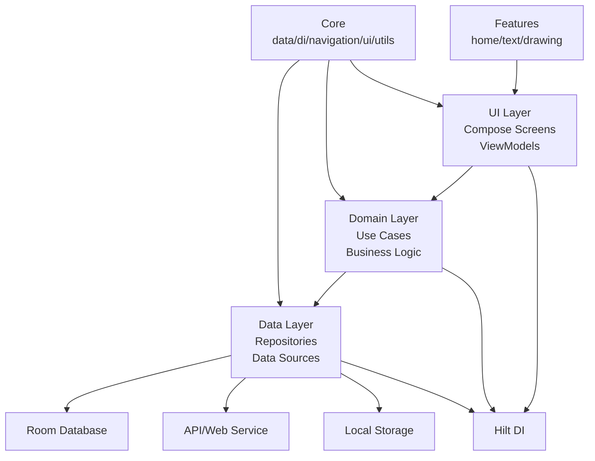

# Projektarchitektur: Notez

## Übersicht

Notez ist eine Android-Anwendung für das Erstellen und Verwalten von Notizen, einschließlich Textnotizen und Zeichnungen. Das Projekt folgt den Prinzipien der **Clean Architecture** und ist in Kotlin mit Jetpack Compose entwickelt. Es verwendet moderne Android-Entwicklungswerkzeuge wie Hilt für Dependency Injection, Room für lokale Datenpersistenz und Navigation Compose für die App-Navigation.

## Architekturprinzipien

Das Projekt implementiert **Clean Architecture** mit folgenden Schichten:

1. **Presentation Layer (UI)**: Compose-UI-Komponenten, ViewModels
2. **Domain Layer**: Business Logic, Use Cases (falls vorhanden)
3. **Data Layer**: Repository, Data Sources (API, Datenbank)

Zusätzlich gibt es eine modulare Aufteilung nach Features und gemeinsame Core-Komponenten.

## Modulaufteilung

Das Projekt besteht aus zwei Hauptmodulen:

- **:app**: Die Haupt-Android-Anwendung
- **:ink-proto**: Ein separates Java-Library-Modul für Protocol Buffers, das für die Serialisierung von Zeichnungsdaten verwendet wird

## Paketstruktur in :app

```
com.example.notez/
├── core/           # Gemeinsame Komponenten
│   ├── data/       # Datenmodelle, Repositories, DAOs
│   ├── di/         # Dependency Injection (Hilt-Module)
│   ├── navigation/ # Navigation-Logik und Routen
│   ├── ui/         # Gemeinsame UI-Komponenten und Themes
│   └── utils/      # Hilfsfunktionen und Utilities
├── features/       # Feature-spezifische Module
│   ├── home/       # Startseite/Home-Screen
│   ├── text/       # Textnotizen-Feature
│   └── drawing/    # Zeichnungs-Feature
├── developer/      # Entwickler-Tools
│   └── brushdesigner/ # Pinsel-Designer für Zeichnungen
├── MainActivity.kt # Haupt-Activity
└── NotezApplication.kt # Application-Klasse mit Hilt
```

## Zuständigkeiten

### Core-Module
- **data**: Verantwortlich für Datenpersistenz (Room), API-Calls (falls vorhanden) und Repository-Pattern
- **di**: Konfiguration von Dependency Injection mit Hilt-Modulen
- **navigation**: Zentrale Navigation-Logik und Routen-Definitionen
- **ui**: Wiederverwendbare UI-Komponenten, Themes und Compose-Utilities
- **utils**: Hilfsfunktionen für Logging, Formatierung, etc.

### Feature-Module
Jedes Feature ist eigenständig und folgt dem gleichen Muster:
- **UI**: Compose-Screens und -Komponenten
- **ViewModel**: State-Management und Business-Logic
- **Repository**: Daten-Zugriff (delegiert an core/data)

### Developer-Module
- Enthält Tools und Features für Entwickler, wie den Brush-Designer für Zeichnungen

## Clean Architecture Diagramm



## Arbeitsaufteilung

Bei der Entwicklung wird pair programming mit AI-Agenten verwendet:

- **Developer A**: UI (Compose), Navigation, State-Handling
- **Developer B**: ViewModel, Repository, API/DB

Synchronisation erfolgt alle 5-10 Minuten. Jeder Entwickler arbeitet parallel an seiner Schicht.

## Technologien

- **Sprache**: Kotlin
- **UI**: Jetpack Compose
- **DI**: Hilt
- **Datenbank**: Room
- **Navigation**: Navigation Compose
- **Serialisierung**: Protocol Buffers (ink-proto)
- **Testing**: Roborazzi für UI-Tests
- **Build**: Gradle mit Kotlin DSL

## Definition of Done

- Feature funktioniert end-to-end
- Keine Abstürze
- Architektur-Prinzipien eingehalten
- Beide Entwickler verstehen die Lösung